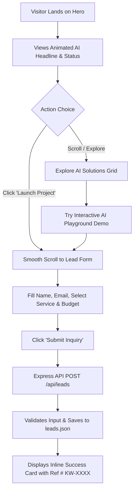
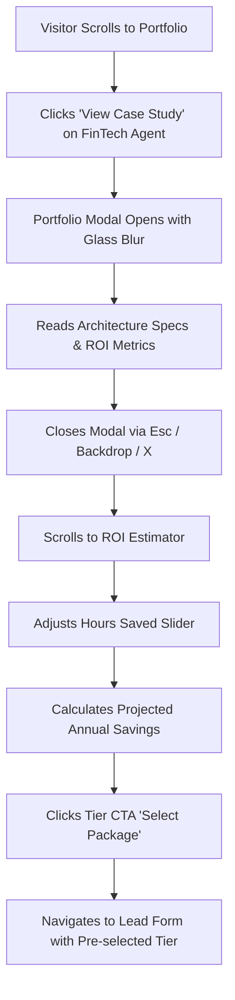
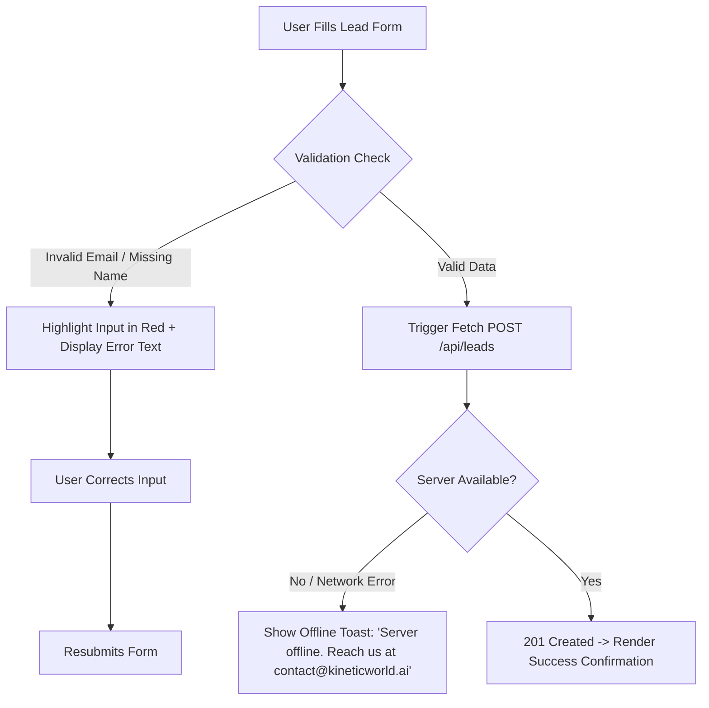

# User Flows & Journeys: KineticWorld

## Journey 1: Primary Lead Conversion (Happy Path)

---

## Journey 2: Portfolio & ROI Evaluation

---

## Journey 3: Form Failure & Offline Recovery Path

---

## 4. State Matrix

| Component | First Use / Default State | Active / Hover State | Error / Failure State | Success State |
|---|---|---|---|---|
| **Hero Banner** | Glowing ambient mesh background, live status badge | Interactive CTA hover neon glow | Fallback static gradient if reduced motion | N/A |
| **Case Studies** | 3 preview cards displayed | Card scale + neon border highlight | Modal fails gracefully if missing data | Expanded case study modal active |
| **AI Playground** | Prompt selector ready | Simulated streaming text animation | Prompt empty error hint | Completed code & metric response view |
| **Lead Form** | Clean form inputs | Active blue ring outline on focus | Red input border + inline error badge | Green checkmark confirmation + Ref ID |
